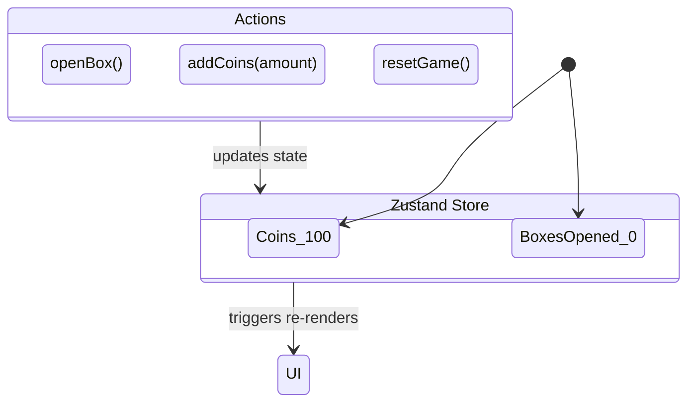

# System Architecture: Lootbox Go

This document describes the technical architecture, directory structure, state flow, and rendering architecture of Lootbox Go.

---

## 1. Directory Structure

The project is structured as a cross-platform React application packaged with Vite and built for mobile using Capacitor.

```
lootbox-go/
├── android/                  # Native Android Studio project managed by Capacitor
├── docs/                     # Game documentation (design, architecture, UI)
├── public/                   # Static assets (favicons, SVG sprite files)
├── scripts/                  # Shell utilities (building, setting up mobile SDKs)
│   ├── setup-mobile-env.ps1  # Installs/validates Android SDKs and paths
│   └── build-apk.ps1         # Compiles the production build and exports the Android APK
├── src/                      # Source React application
│   ├── assets/               # Visual assets (illustrations, icons)
│   ├── components/           # Reusable UI elements (BoundingBox container)
│   ├── hooks/                # Custom React hooks (useGameLoop)
│   ├── store/                # Zustand global state configurations (gameStore)
│   ├── utils/                # Utility scripts (AssetLoader helper)
│   ├── App.tsx               # Main application view and gameplay canvas controller
│   ├── index.css             # Root stylesheet and Tailwind-inspired theme configuration
│   └── main.tsx              # Application entry point
├── capacitor.config.ts       # Capacitor project configuration
├── vite.config.ts            # Vite compile and asset pipeline instructions
└── package.json              # Node dependencies and project metadata
```

---

## 2. State Management (Zustand)

Lootbox Go utilizes **Zustand** for lightweight, predictable, and highly performant state management.



* **File**: [gameStore.ts](file:///c:/Users/ishan/Documents/GitHub/lootbox-go/src/store/gameStore.ts)
* **Store Schema**:
  ```typescript
  interface GameState {
    coins: number;
    boxesOpened: number;
    openBox: () => void;
    addCoins: (amount: number) => void;
    resetGame: () => void;
  }
  ```
* **Store Details**:
  * Action `openBox` automatically deducts 10 gold, generates a random refund coin bonus between 0 and 24, adds that refund back to the coin balance, and increments the `boxesOpened` counter.
  * Reacting components call `useGameStore()` selector hooks to subscribe only to the slices of state they need.

---

## 3. High-Performance Animation & Particles Pipeline

Animations are split into two layers to ensure a smooth 60 FPS experience:

### A. Dynamic Particle Canvas (VFX Layer)
* **How it works**: A dedicated `<canvas>` covers the app viewport. A custom React hook `useGameLoop` uses `requestAnimationFrame` to run an update/render loop.
* **Physics engine**: Simple gravity (`vy += 0.2`) and friction/drag vector updating are calculated on each frame based on `deltaTime`.
* **State**: Spawning appends particles into a mutable `useRef<Particle[]>` array to avoid triggering React component re-renders on every animation frame.

### B. Structural UI Animations (Framer Motion Layer)
* **How it works**: State machine in `App.tsx` governs the visual chest state (`'idle' | 'opening' | 'open'`).
* **Exit/Entry**: `<AnimatePresence>` manages standard exit/enter animations as React components mount and unmount.
* **Keyframes**: The "opening" shake is handled via an array of keyframes for scale and rotation (`rotate: [0, -10, 10, ...], scale: [1, 1.1, ...]`).

---

## 4. Mobile Compilation (Capacitor)

The mobile target utilizes Capacitor to bridge Web APIs to Android.
* **Config**: [capacitor.config.ts](file:///c:/Users/ishan/Documents/GitHub/lootbox-go/capacitor.config.ts) sets up the web assets directory (`dist/`) and targets the package name `com.lootbox.go`.
* **Syncing**: Whenever frontend files are modified, `npm run build` is run to compile static files, and `npx cap sync android` copies them into `android/app/src/main/assets/public/`.
* **Gradle Wrapper**: The android build scripts leverage Gradle to build the native debug or release APK directly from the console.
