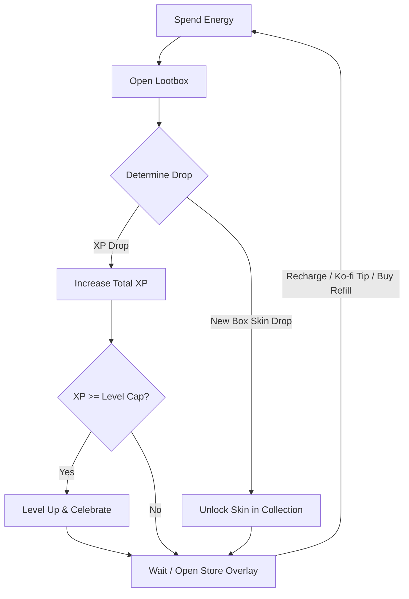

# Lootbox Go! - Game Design Document (GDD)

**Lootbox Go!** is a satirical idle/clicker game designed to critique and parody modern mobile free-to-play game mechanics, specifically focusing on Skinner box feedback loops, energy restrictions, and rigged onboarding algorithms. 

### Related Documents
- [UI & UX Specification](file:///c:/Users/ishan/Documents/GitHub/lootbox-go/docs/ui_ux.md) - HUD layout, Bottom drawer Collection view, and Store overlay design.
- [Art Direction Specification](file:///c:/Users/ishan/Documents/GitHub/lootbox-go/docs/art_direction.md) - Theme guidelines, color systems, and animation timing rules.
- [Economy & Balancing Specification](file:///c:/Users/ishan/Documents/GitHub/lootbox-go/docs/economy_balancing.md) - Detailed XP scaling formulas, pull expectations, and drop weights.
- [Technical Architecture Document](file:///c:/Users/ishan/Documents/GitHub/lootbox-go/docs/architecture.md) - Zustand state managers, persistence adapters, and offline calculation timings.
- [Testing & QA Specification](file:///c:/Users/ishan/Documents/GitHub/lootbox-go/docs/testing_and_qa.md) - SECRET badge tap panel, testing checklists, and statistical simulator script.

---

## 1. Game Overview

### 1.1 Satirical Premise
The entire game is a self-aware parody. It provides the player with standard mobile gaming "rewards" (XP, levels, and skins) for performing a completely empty, non-strategic action: opening boxes. By framing this useless action with flashy animations, slot-machine sound effects, and artificial time gates (energy), the game mocks the psychological manipulation utilized by contemporary free-to-play titles.

### 1.2 Target Platform & Visual Style
- **Platform:** Cross-platform web and mobile wrapper (React, Vite, TS, Zustand, framer-motion, Capacitor).
- **Aesthetic:** High-fidelity, polished, and extremely flashy. It should look like a premium, top-grossing mobile game with vibrant colors, neon glows, dramatic card-flipping/opening animations, and celebratory particles.

---

## 2. Core Game Loop

1. **Spend Energy:** The player initiates the loop by spending 1 Energy to open the currently selected lootbox skin.
2. **Open Lootbox:** A dramatic, dopamine-inducing opening animation plays.
3. **Gain Reward:** The box yields either an XP drop or, rarely, a new themed lootbox skin.
4. **Progress & Customization:**
   - XP accumulates towards the next Level. Leveling up triggers celebratory UI overlays.
   - Newly unlocked skins can be selected in the **Lootbox Collection bottom drawer** to change the active skin theme.

---

## 3. Core Mechanics

### 3.1 Energy System
To limit player activity and simulate microtransaction friction, the game uses an Energy system.
- **Capacity:** Standard maximum capacity of 10 Energy.
- **Consumption:** Costs 1 Energy to open any lootbox.
- **Passive Recharge:** Recharges by 1 Energy every 30 seconds when below capacity. Passive recharge halts if the current energy is equal to or greater than the capacity (10).
- **Energy Overflow:** Unlike traditional limits, purchasing energy packages in the store allows energy values to exceed the maximum capacity limit (e.g., buying a 50 Energy pack yields a balance of `50/10` or more). Passive recharge only resumes once energy falls back below 10.
- **Customizability:** Starting Pinata balance, max energy capacity, recharge rate, refill package options, and the external Ko-fi URL are easily configured via static JSON files.

#### Satirical Tipping & Pinata Refills
When players run out of energy or want to stockpile it, they can access the **Store Modal Overlay** (via the shopping cart icon in the Top HUD) to choose between the following satirical monetization flows:
1. **Purchase Energy with Pinatas 🪅:** Players can spend their **Pinatas 🪅** premium currency on three energy packages:
   - **5 Energy** for 10 Pinatas.
   - **15 Energy** for 20 Pinatas.
   - **50 Energy** for 30 Pinatas. (Purchasing this package overflows the energy capacity).
2. **Click Ko-fi Link for Free Pinatas:** To refill Pinatas, players can click the **"TIP ME HERE Ko-fi"** button in the Store, which points to the creator's tipping page: `https://ko-fi.com/ishanmanjrekar/tip`.
   - **Instant Reward (No Verification):** Since the game runs purely client-side without servers or two-way authentication, clicking the link immediately rewards the player with **+100 Pinatas 🪅**. The game parodies corporate paywalls by allowing players to click the link repeatedly to gain unlimited premium currency for free.

### 3.2 Progression & Leveling
Leveling up is the primary progression metric, demonstrating a number that goes up indefinitely with no actual gameplay changes.
- **Level Cap:** Infinite levels.
- **Level-Up Requirements:** 
  - **Level 1:** Hardcoded to **50 XP** to ensure a rapid first level-up.
  - **Level 2+:** Calculated using an exponential scaling formula, configured via JSON.
- **Visual Feedback:** 
  - Each level up triggers high-contrast screen shake, confetti, and celebratory text.
  - To simulate a premium tier progression, the Level number text becomes increasingly flashy, shiny, and dynamic (e.g., shifting from plain text to gold, neon, and rainbow glows) every 5 or 10 levels.

### 3.3 Extensible Lootbox Collection Screen
The **Collection Screen** houses all unlocked box skins. Changing the active box skin alters the visual assets displayed on the main opening screen.
- **Purely Cosmetic:** Unlocked boxes provide no functional gameplay advantages.
- **Extensible File-Based Architecture:** Adding a new box (which can be any theme or image) to the game is as simple as:
  1. Placing a closed state image (`<box-id>-closed.png`) and an open state image (`<box-id>-open.png`) into the assets folder.
  2. Registering the new box entry (id, name, rarity, description) in the central configuration JSON.
  * *Default Box:* The first starting box is configured as `box-start` (assets: `box-start-closed.png` and `box-start-open.png`).
- **Automatic Selection:** When a new box skin is unlocked, the game automatically switches the active skin to the newly unlocked box to trigger immediate visual gratification.
- **Placebo Stats:** Skins display mock stats (e.g., "CEO Golden Safe: +9999% Luck") in the UI to satirize F2P stats, but these stats have no effect on drop math.

---

## 4. Drop Tables, Weights, & Rigged Onboarding

Drops are determined by weights loaded from the configuration JSON.

### 4.1 Drop Categories
- **XP Drops:** Evaluated as a percentage of the XP required for the *next* level, with an added $\pm 5\%$ additive variation to look organic.
- **Box Skin Drops:** Unlocks a random themed box skin not currently owned by the player.
  - **Duplicate Conversion:** If the rolled drop is a skin that the player already owns, the UI plays a high-gratification "JACKPOT!" animation, then degrades to show the skin converting into a tiny mock reward (**1 Pinata 🪅**) with a satirical message.

### 4.2 Drop Table Weights (Standard Mode - Level 6+)
Standard weights are defined out of a total sum of **1000**:

| Drop ID | Reward Type | Base XP Value | Variation Range | Base Weight | Probability (Base) | Satirical Purpose |
| :--- | :--- | :---: | :---: | :---: | :---: | :--- |
| `skin_unlock` | Box Skin | N/A | N/A | 1 | **0.1%** | Ultra-rare cosmetic jackpot. |
| `xp_45` | XP Percentage | 45% of next level | $\pm 5\%$ | 19 | **1.9%** | Rare, massive boost. |
| `xp_30` | XP Percentage | 30% of next level | $\pm 5\%$ | 30 | **3.0%** | Moderate progression jump. |
| `xp_20` | XP Percentage | 20% of next level | $\pm 5\%$ | 50 | **5.0%** | Standard high-tier reward. |
| `xp_18` | XP Percentage | 18% of next level | $\pm 5\%$ | 100 | **10.0%** | Frequent medium progress. |
| `xp_15` | XP Percentage | 15% of next level | $\pm 5\%$ | 100 | **10.0%** | Standard progress step. |
| `xp_12` | XP Percentage | 12% of next level | $\pm 5\%$ | 200 | **20.0%** | High-frequency micro-reward. |
| `xp_10` | XP Percentage | 10% of next level | $\pm 5\%$ | 200 | **20.0%** | High-frequency micro-reward. |
| `xp_8` | XP Percentage | 8% of next level | $\pm 5\%$ | 300 | **30.0%** | Baseline bread-and-butter drop. |

#### Early Game Skin Boost (Level 1 to 5)
To hook players, the base weight of `skin_unlock` is temporarily boosted to **200** from Level 1 up to Level 5. The total weight sum becomes **1199**, providing a boosted **~16.68%** chance to unlock skins.

#### Dynamic Skin Pity System
To simulate a rigged gacha pity system:
1. Every consecutive roll that does not yield a box skin increases the `skin_unlock` weight by **`+3`** for the next roll.
2. Upon successfully rolling a skin, the weight resets to its level-appropriate base (**200** if Level $\le 5$, or **1** if Level $\ge 6$).

### 4.3 Rigged Onboarding (First-Time User Experience)
To maximize user retention and hook the player immediately, the first six rolls are strictly deterministic:

1. **Roll 1 (Level 1):** Drops **80% XP** (variation $\pm 10\%$, resulting in **35 to 45 XP**).
2. **Roll 2 (Level 1):** Drops **20% XP** (variation $\pm 10\%$, resulting in **5 to 15 XP**). 
   * *Level Up:* Guaranteed to sum to at least 50 XP, triggering a level up to Level 2.
3. **Roll 3 (Level 2):** Drops **30% XP** (variation $\pm 10\%$, resulting in **69 to 137 XP**).
4. **Roll 4 (Level 2):** Guaranteed **`skin_unlock`** (unlocks a new random box skin).
5. **Roll 5 (Level 2):** Drops **35% XP** (variation $\pm 5\%$, resulting in **103 to 137 XP**).
6. **Roll 6 (Level 2):** Drops **35% XP** (variation $\pm 5\%$, resulting in **103 to 137 XP**). 
   * *Level Up:* Guaranteed to sum with Roll 3 and 5 to at least 100% of Level 2 required XP (344 XP), triggering a level up to Level 3.

From **Roll 7 onward**, the game transitions to standard weight-based rolling using the dynamic pity system (using the Level $\le 5$ boosted skin weight of 200 until the player levels up to Level 6).
