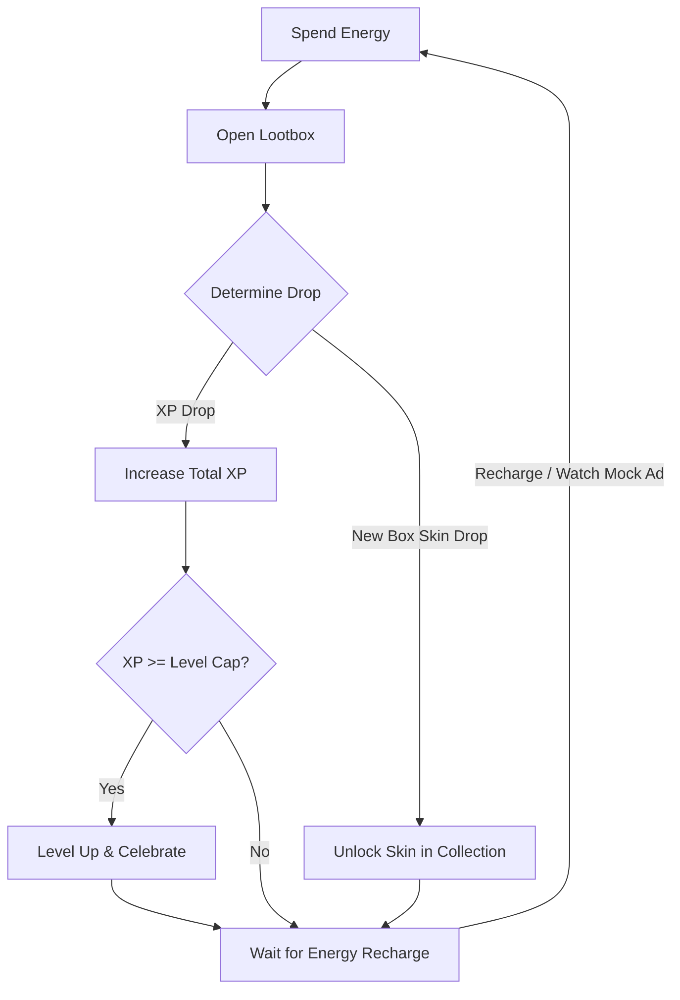

# Lootbox Go! - Game Design Document (GDD)

**Lootbox Go!** is a satirical idle/clicker game designed to critique and parody modern mobile free-to-play game mechanics, specifically focusing on Skinner box feedback loops, energy restrictions, and rigged onboarding algorithms. 

---

## 1. Game Overview

### 1.1 Satirical Premise
The entire game is a self-aware parody. It provides the player with standard mobile gaming "rewards" (XP, levels, and skins) for performing a completely empty, non-strategic action: opening boxes. By framing this useless action with flashy animations, slot-machine sound effects, and artificial time gates (energy), the game mocks the psychological manipulation utilized by contemporary free-to-play titles.

### 1.2 Target Platform & Visual Style
- **Platform:** Cross-platform web and mobile wrapper (React, Vite, TS, Zustand, framer-motion, Capacitor).
- **Aesthetic:** High-fidelity, polished, and extremely flashy. It should look like a premium, top-grossing mobile game with vibrant colors, neon glows, dramatic card-flipping/opening animations, and celebratory particles.

---

## 2. Core Game Loop

1. **Spend Energy:** The player initiates the loop by spending 1 Energy (out of a max of 10) to open the currently selected lootbox.
2. **Open Lootbox:** A dramatic, dopamine-inducing opening animation plays.
3. **Gain Reward:** The box yields either an XP drop or, rarely, a new themed lootbox skin.
4. **Progress & Customization:**
   - XP accumulates towards the next Level. Leveling up triggers flashing UI effects.
   - Newly unlocked skins can be selected in the **Collection Screen** to change the visual theme of the box being opened.

---

## 3. Core Mechanics

### 3.1 Energy System
To limit player activity and simulate the feeling of artificial friction, the game uses an Energy system.
- **Capacity:** Maximum of 10 Energy.
- **Consumption:** Costs 1 Energy to open any lootbox.
- **Passive Recharge:** Recharges by 1 Energy every 30 seconds (when below capacity).
- **Customizability:** Recharge times, max capacity, and costs are configured via JSON.

#### Satirical P2W (Pay-To-Win) Refills
When out of energy, players are presented with two mock monetization options:
1. **"Watch Mock Ad" Button:** Starts a 3-second countdown displaying a satirical, low-effort ad (e.g., "Pull the Pin to Save the Hero!", "Fake Casino Slot Simulator"). Completing the ad grants **+1 Energy**.
2. **"Buy Energy" Button:** Instantly refills energy to 10 by spending fake premium currency (e.g., "Gullible Coins" or "Clown Gems"). The game will mockingly prompt the player to "confirm purchase" using fake credit card screens.

### 3.2 Progression & Leveling
Leveling up is the primary progression metric, demonstrating a number that goes up indefinitely with no actual gameplay changes.
- **Level Cap:** Infinite levels.
- **Level-Up Requirements:** Calculated using an exponential scaling formula, configured via JSON.
- **Visual Feedback:** 
  - Each level up triggers high-contrast screen shake, confetti, and celebratory text.
  - To simulate a premium tier progression, the Level number text becomes increasingly flashy, shiny, and dynamic (e.g., shifting from plain text to gold, neon, and rainbow glows) every 5 or 10 levels.

### 3.3 Extensible Lootbox Collection Screen
The **Collection Screen** houses all unlocked box skins. Changing the active box skin alters the visual assets displayed on the main opening screen.
- **Purely Cosmetic:** Unlocked boxes provide no functional gameplay advantages.
- **Extensible File-Based Architecture:** Adding a new box to the game is as simple as:
  1. Placing a closed state image (`<box-id>_closed.png`) and an open state image (`<box-id>_open.png`) into the assets folder.
  2. Registering the new box entry (id, name, rarity, description) in the central configuration JSON.
- **Automatic Selection:** When a new box skin is unlocked, the game automatically switches the active skin to the newly unlocked box to trigger immediate visual gratification.

---

## 4. Drop Tables, Weights, & Rigged Onboarding

Drops are determined by weights loaded from the configuration JSON.

### 4.1 Drop Categories
- **XP Drops:** Evaluated as a percentage of the XP required for the *next* level.
  - *Small XP Drop:* E.g., 10% of next level's requirement (with a $\pm10\%$ random error to look "organic").
  - *Medium XP Drop:* E.g., 30% of next level's requirement.
  - *Large XP Drop:* E.g., 60% of next level's requirement.
- **New Box Skin Drops:** Unlocks a random themed box skin not currently owned by the player.

### 4.2 Drop Table Weights (Example Config)

| Drop Outcome | Formula / Value | Default Weight | Satirical Purpose |
| :--- | :--- | :--- | :--- |
| **Small XP Drop** | $10\% \text{ of next level XP} \pm 10\%$ error | 300 | Frequent micro-rewards. |
| **Medium XP Drop** | $30\% \text{ of next level XP} \pm 10\%$ error | 100 | Moderate progress jump. |
| **Large XP Drop** | $60\% \text{ of next level XP} \pm 10\%$ error | 20 | Exciting high-value progress. |
| **New Box Skin** | Unlock a new cosmetic box | 1 | "Rare" jackpot reward. |

### 4.3 Rigged Onboarding (First-Time User Experience)
To maximize user retention and hook the player, the first three lootbox openings are strictly rigged:
1. **Pull 1:** Guaranteed to unlock a new themed box skin (e.g., "Cardboard Box Deluxe") to give the player an immediate sense of luck and reward.
2. **Pull 2:** Guaranteed to unlock a second themed box skin (e.g., "Neon Neo-Box").
3. **Pull 3:** Guaranteed to drop a large XP reward that triggers an instant level-up, showing the flashing "LEVEL UP!" celebratory screen and hooking the player with immediate progression.

Once these initial pulls are completed, the drop generator transitions to the standard, JSON-defined weight table.
