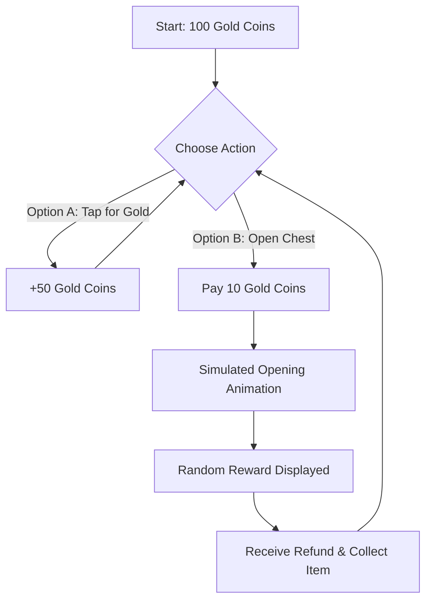

# Game Design Document: Lootbox Go

Lootbox Go is a high-engagement, hyper-satisfying casual clicker/gacha game designed for mobile (via Capacitor) and web. The core focus of the game is the thrill of opening lootboxes, managing a virtual gold economy, and collecting item rewards.

---

## 1. Core Gameplay Loop

The core player loop is structured around risk, reward, and incremental progression:

1. **Earn Currency**: The player starts with 100 gold coins. They can manually add gold (+50 coins) or earn it passively.
2. **Spend & Roll**: Opening a chest costs **10 Gold Coins**.
3. **Reward**: Opening a chest triggers an excitement-building animation, granting:
   - A random virtual item from the Loot Table.
   - A random amount of gold refunded (between `0` and `24` coins, average return of `12` coins, making the net cost `+2` coins on average or an opportunity for profit).
4. **Collect**: The player accumulates rare items and increases their "Boxes Opened" counter.

---

## 2. Loot Table & Probabilities

Rewards are divided into standard rarity tiers to drive long-term engagement.

| Tier | Reward | Probability | Description |
| :--- | :--- | :---: | :--- |
| **Common** | 🪙 Extra Gold Pile | 35% | Small gold bundle to sustain opening loops. |
| **Rare** | ⚔️ Mystic Shield | 25% | Classic adventurer shield with steel bindings. |
| **Rare** | 💎 100 Rare Crystals | 20% | Premium crafting resource. |
| **Epic** | 🦊 Cute Fire Pet | 12% | Animated companion that follows the player. |
| **Legendary** | ✨ Legendary Sword of Geminis | 6% | Ultra-rare elemental weapon with particle trails. |
| **Legendary** | 👑 Crown of Sovereignty | 2% | The ultimate crown worn by rulers of old. |

---

## 3. Economy & Balance

To keep the game feel addictive and rewarding:
* **Cost per Pull**: 10 Gold.
* **Return Distribution**: A uniform random distribution `Math.floor(Math.random() * 25)`.
  * **Min return**: 0 Gold (net cost -10).
  * **Max return**: 24 Gold (net profit +14).
  * **Expected value**: 12 Gold returned per opening.
* **Sustainable Loops**: Because the expected value of returns is greater than the cost (12 gold returned vs 10 gold cost), the economy has a built-in inflation rate. This makes the game feel generous and keeps players from getting stuck in "zero gold" states too easily.

---

## 4. Audio & VFX Design Goals (Future Backlog)

To enhance the sensory satisfaction of the game:
* **Idle State**: Soft floating animation on the chest, subtle glowing aura behind the box.
* **Tapping/Initiating**: Instant high-frequency particle emission (sparkles) from the point of contact.
* **Opening State**: Shaking animation increasing in frequency, ending in a dramatic explosion of gold and colored stars.
* **Reveal State**: A clean, slow zoom-in on the item card with a rare/epic/legendary-colored glow framing the card based on item rarity.
* **Sound Effects**:
  * Hover/Click: High-pitched wooden block click.
  * Chest opening/rattle: Wooden creak and mechanical gears turning.
  * Gold collection: Metallic coin chime (pitch scaled upwards for multi-gains).
  * Legendary unlock: Orchestral choir chime.
